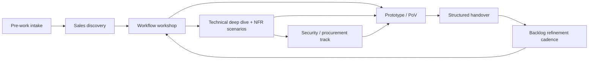

# Requirements Discovery Playbook

This site is a **practical, phased playbook** for gathering software requirements with customers.
It’s designed to be usable by **Sales**, **Solutions Architects**, **Product/Delivery**, and **Customer stakeholders**.

## The core idea
Requirements gathering is **not** a single meeting. It’s a sequenced process that:
- starts with outcomes and workflows (not features),
- validates feasibility and non-functional requirements (NFRs) with the right technical stakeholders,
- runs security/procurement in parallel to avoid late blockers,
- produces a delivery-ready handover packet and backlog refinement cadence.

## Recommended flow

## Start here
- [Common Overview](overview/)
- [How to run the process](process/)
- [Phase-by-phase guides](phases/)
- [Role-based guides](audiences/)
- [Templates (copy/paste)](templates/)
- [References](references/)
