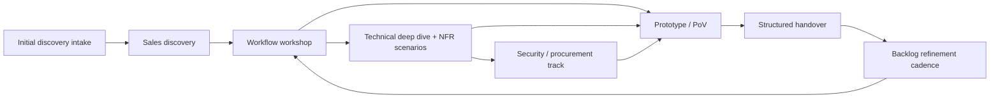

# Requirements Discovery Playbook

This site is a **practical, phased playbook** for gathering software requirements with customers.
It’s designed to be usable by **Sales / Account Executives**, **Solutions Architects**, **Product Managers / Delivery Leads**, and **Customer stakeholders**.

Use it when you need to:
- qualify an opportunity without over-committing,
- turn vague requests into workflows, constraints, and decisions,
- involve the right customer roles at the right time,
- and hand discovery into delivery without losing intent.

## How to use this playbook

1. If you are **new to the method**, start with [Common Overview]({{ "/overview/" | relative_url }}) and [How to run the process]({{ "/process/" | relative_url }}).
2. If you are **running a real opportunity**, check the [Commercial boundary]({{ "/commercial-boundary/" | relative_url }}) first so you know what should stay directional versus what should become paid discovery.
3. If you need to **brief a participant**, send them the relevant [Role-based guide]({{ "/audiences/" | relative_url }}) before the session.
4. If you need to **run a specific session**, open the relevant [Phase guide]({{ "/phases/" | relative_url }}) and matching [Template]({{ "/templates/" | relative_url }}) side by side.
5. If you need to **move from discovery to build**, finish with the [Structured handover phase]({{ "/phases/handover/" | relative_url }}) and the [Handover packet template]({{ "/templates/handover-packet/" | relative_url }}).

## Common use cases

| If you need to... | Start here | Then use this | Primary owner |
|---|---|---|---|
| Run the first serious customer discovery conversation | [Initial discovery intake]({{ "/phases/intake/" | relative_url }}) | [Sales discovery call]({{ "/phases/sales-discovery/" | relative_url }}) and the [initial discovery intake form]({{ "/templates/initial-discovery-intake-form/" | relative_url }}) | Sales / Account Executive |
| Align the team on outcomes, stakeholders, and why this work matters | [Common Overview]({{ "/overview/" | relative_url }}) | [Role-based guides]({{ "/audiences/" | relative_url }}) and [How to run the process]({{ "/process/" | relative_url }}) | Sales / Account Executive + Executive Sponsor / Product Owner |
| Turn a feature discussion into a real workflow and MVP slice | [Workflow workshop]({{ "/phases/workflow-workshop/" | relative_url }}) | [Workflow workshop pack]({{ "/templates/workflow-workshop/" | relative_url }}) | Product Manager / Delivery Lead |
| Validate integrations, environments, access, and NFRs | [Technical deep dive + NFR scenarios]({{ "/phases/technical-deep-dive/" | relative_url }}) | [Technical deep dive template]({{ "/templates/technical-deep-dive/" | relative_url }}) | Solutions Architect |
| Handle security review or procurement before it becomes a blocker | [Security / procurement track]({{ "/phases/security-procurement/" | relative_url }}) | [Security evidence pack template]({{ "/templates/security-evidence-pack/" | relative_url }}) | Security / Compliance / GRC |
| Prove the riskiest assumptions with a thin end-to-end slice | [Prototype / PoV]({{ "/phases/pov/" | relative_url }}) | [PoV plan]({{ "/templates/pov-plan/" | relative_url }}) | Product Manager / Delivery Lead + Engineering + SA |
| Turn discovery outputs into delivery-ready backlog and ownership | [Structured handover]({{ "/phases/handover/" | relative_url }}) | [Handover packet + backlog format]({{ "/templates/handover-packet/" | relative_url }}) | Product Manager / Delivery Lead |

## The core idea
Requirements gathering is **not** a single meeting. It’s a sequenced process that:
- starts with outcomes and workflows (not features),
- validates feasibility and non-functional requirements (NFRs) with the right technical stakeholders,
- runs security/procurement in parallel to avoid late blockers,
- produces a delivery-ready handover packet and backlog refinement cadence.

## Recommended flow

## Start by role

- **Sales / Account Executive**: start with [Commercial boundary]({{ "/commercial-boundary/" | relative_url }}), [Initial discovery intake]({{ "/phases/intake/" | relative_url }}), [Sales discovery call]({{ "/phases/sales-discovery/" | relative_url }}), and the [Sales / Account Executive guide]({{ "/audiences/sales/" | relative_url }}).
- **Solutions Architect**: start with [How to run the process]({{ "/process/" | relative_url }}), [Technical deep dive + NFR scenarios]({{ "/phases/technical-deep-dive/" | relative_url }}), and the [Solutions Architect guide]({{ "/audiences/solutions-architect/" | relative_url }}).
- **Product Manager / Delivery Lead**: start with [Workflow workshop]({{ "/phases/workflow-workshop/" | relative_url }}), [Structured handover]({{ "/phases/handover/" | relative_url }}), and the [Product Manager / Delivery Lead guide]({{ "/audiences/product-delivery/" | relative_url }}).
- **Security / Compliance / GRC**: start with [Security / procurement track]({{ "/phases/security-procurement/" | relative_url }}), the [security evidence pack template]({{ "/templates/security-evidence-pack/" | relative_url }}), and the [Security / Compliance / GRC guide]({{ "/audiences/security/" | relative_url }}).
- **Customer stakeholders**: start with [Common Overview]({{ "/overview/" | relative_url }}) and then open your specific [audience guide]({{ "/audiences/" | relative_url }}) before attending workshops.

## What this playbook helps prevent

- Treating discovery like one generic “requirements meeting”
- Expecting one customer person to answer business, workflow, technical, and security questions alone
- Producing delivery-grade artifacts before commercial expectations are clear
- Re-discovering the same requirements again during implementation

## Start here
- [Common Overview]({{ "/overview/" | relative_url }})
- [How to run the process]({{ "/process/" | relative_url }})
- [Commercial boundary (free vs paid)]({{ "/commercial-boundary/" | relative_url }})
- [Phase-by-phase guides]({{ "/phases/" | relative_url }})
- [Role-based guides]({{ "/audiences/" | relative_url }})
- [Templates (copy/paste)]({{ "/templates/" | relative_url }})
- [References]({{ "/references/" | relative_url }})
